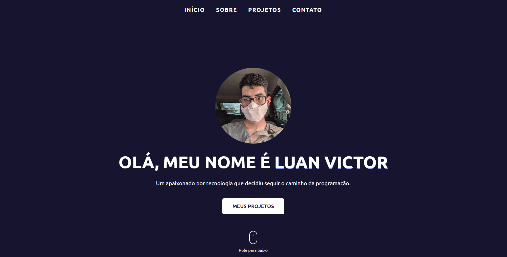
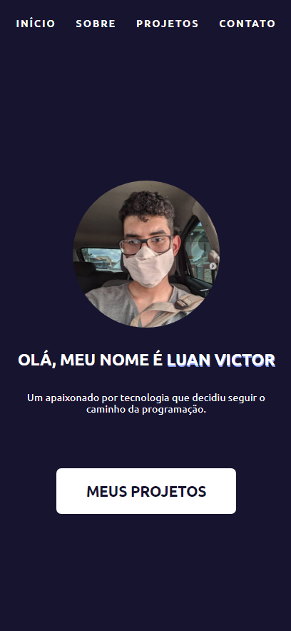

# Olá! Este é Meu Portifólio.

Um website que reúne informações sobre quem sou e o que faço. Nele será possível saber mais sobre mim e visualizar alguns projetos que acho válido destacar.

## Demonstração




[Visite aqui!](https://lvictor-portfolio.vercel.app/)

## Técnologias usadas

Front-end:

> Desenvolvido usando: ES6, JavaScript, React.js, HTML5, CSS3, e AOS.

## Funcionalidades

- Responsivo

## Instalando Dependências

> Frontend

```bash
cd react-portfolio/
npm install
```

> Executando a aplicação

```
  cd src/ && npm start
```

## Créditos

- [ícones](https://icon-icons.com/)
- [Gif](https://dribbble.com/eown)
